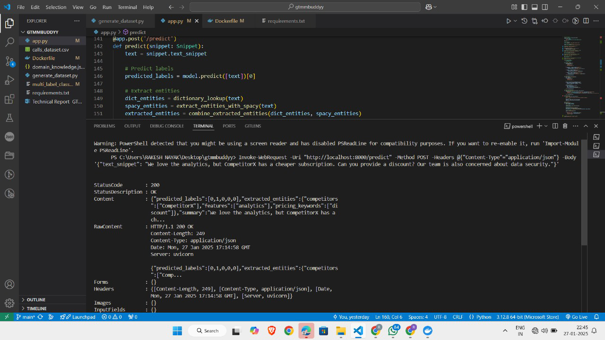

## Multi-Label Text Classification and Entity Extraction 
This is a FastAPI-based application for multi-label text classification, entity extraction, and summarization. It uses a pre-trained machine learning model and spaCy for natural language processing tasks. The application is containerized using Docker for easy deployment.
## Project Directory
```
/GTMMBUDDYY
  ├── app.py
  ├── calls_dataset.csv
  ├── Dockerfile
  ├── domain_knowledge.json
  ├── generate_dataset.py
  ├── multi_label_classifier.pkl
  ├── requirements.txt
```
  
## Features
1.Multi-Label Text Classification:

Predicts labels for a given text snippet using a pre-trained model.

2.Entity Extraction:

Extracts entities like competitors, features, and pricing keywords using a domain knowledge base and spaCy.

3.Text Summarization:

Generates a summary of the input text using spaCy.

## Prerequisites
Before running the application, ensure you have the following installed:

1.Docker: Install Docker

2.Python: Install Python (optional, for local development)

## Setup Instructions
### local setup
1. Clone the Repository
Clone this repository to your local machine:
```bash
git clone https://github.com/Rakesh4nayak/GTM_BUDDY_
```
2.change repository
```bash
cd GTM_BUDDY_
```
### Docker setup
1. Build the Docker Image
Build the Docker image using the provided Dockerfile:
```bash
docker build -t nlp-service .
```

3. Run the Docker Container
Run the Docker container, mapping port 8000 on your host to port 8000 in the container:
```bash
docker run -p 8000:8000 nlp-service
```
### Access the Application
Once the container is running, you can access the application at:

Swagger UI: http://localhost:8000/docs

Redoc: http://localhost:8000/redoc

### Test end points using cURL
Predict Labels and Extract Entities
Send a POST request to the /predict endpoint with a JSON body containing the text snippet.
#### Sample Curl to call the end point
#### Example Request
```bash
Invoke-WebRequest -Uri "http://localhost:8000/predict" -Method POST -Headers @{"Content-Type"="application/json"} -Body '{"text_snippet": "We love the analytics, but CompetitorX has a cheaper subscription. Can you provide a discount? Our team is also concerned about data security."}'
```

#### Example Response
```
json
{
  "predicted_labels": [1, 0, 1, 0, 0],
  "extracted_entities": {
    "competitors": ["CompetitorX"],
    "features": ["analytics"],
    "pricing_keywords": ["discount"]
  },
  "summary": "We love the analytics, but CompetitorX has a cheaper subscription."
}
```
### Without Docker:

Install Dependencies:
If you want to run the application locally without Docker, install the required Python packages:
```bash
pip install -r requirements.txt
```
     
```bash
python -m spacy download en_core_web_sm
```

Run the Application Locally
Start the FastAPI server:
```bash
uvicorn app:app --reload
```
## Results


## Future Work
#### 1.Data Curation: 
**-** Collect more balanced datasets, particularly for underrepresented labels like Positive.

**-** Label refinement to reduce ambiguity and overlap. 
#### 2.Advanced Modeling: 
**-** Fine-tune pre-trained transformer models (e.g., BERT, RoBERTa) for multi-label 
classification. 


**-** Experiment with hierarchical attention networks to better handle label 
dependencies. 
#### 3.Enhanced Entity Extraction: 
**-** Incorporate contextual embeddings into the entity extraction pipeline. 

**-** Expand domain knowledge dictionaries with synonyms and variations for more 
comprehensive coverage. 
#### 4.Real-Time Deployment: 
**-** Implement a feedback loop to refine model performance over time based on user 
corrections. 

**-** Integrate the model into an end-to-end pipeline for real-time classification and entity 
extraction.


